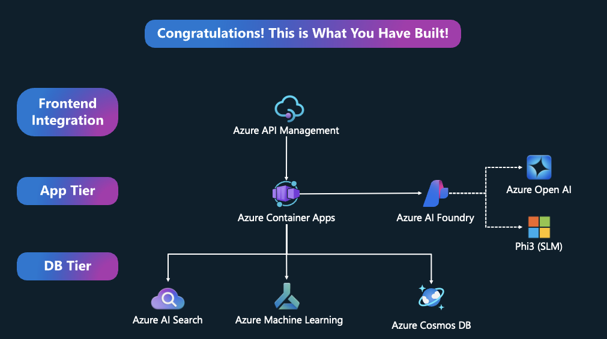

# Azure Utopia Final References
This repository contains the final references for the Azure Utopia project. The references covers the Azure command line and  sample code to complete the tasks.

## How To Build API with Python Flask
A quick guide on how to build an API with Python Flask, and deploy as a container.

### Step 1: Prepare requirement file
Installation of Python requirement file is straight forward. Create a file called `requirements.txt` and add the following content:
```bash
Flask
```

### Step 2: Create a Python Flask API
Create a file called `main.py` and add the following content.


🤖 Sample GitHub Copilot Prompt
```text
create a flask api with an endpoint for health.
```

```python
from flask import Flask, jsonify

app = Flask(__name__)

@app.route('/health', methods=['GET'])
def health():
    return jsonify({"status": "healthy"}), 200

if __name__ == '__main__':
    app.run(host='0.0.0.0', port=5000)
```

### Step 3: Build Dockerfile
Create a file called `Dockerfile` and add the following content.


🤖 Sample GitHub Copilot Prompt
```text
create a Dockerfile for Python Flask API.
```

```Dockerfile
# Use the official Python image from the Docker Hub
FROM python:3.13-slim

# Set the working directory in the container
WORKDIR /app

# Copy the requirements file into the container
COPY requirements.txt .

# Install the dependencies
RUN pip install --no-cache-dir -r requirements.txt

# Copy the rest of the application code into the container
COPY . .

# Expose the port the app runs on
EXPOSE 5000

# Run the application
CMD ["python", "main.py"]
```

### Step 4: Build and Run the Docker Container
Build the Docker container using the following command:
```bash
docker build -t python-flask-api .
docker run -p 5000:5000 python-flask-api
```

## Azure Utopia Task Details
The following are the tasks that need to be completed for the Azure Utopia project.

| Stage  | Stage Name                | Reference   |
|---------|---------------------------------|----------|
| 1       | Who Are We? Brand Ourselves!         | [Reference](./Stage_1/README.md) |
| 2       | I Want To Find Out More   | [Reference](./Stage_2/README.md) |
| 3       | You Are The Lucky One             | [Reference](./Stage_3/README.md)  |
| 4       | Onboard Now            | [Reference](./Stage_4/README.md)  |
| 5       | Welcome To Utopia!             | [Reference](./Stage_5/README.md)  |

## Azure Utopia Project Architecture
Congratulations! This is what we have built!



Here's the presentation slide shared: [Azure Utopia Event PDF](./asset/Azure%20Utopia%20Event.pdf)

## Clean Up
The project is designed to be self-contained. However, you can clean up the resources by deleting the resource group.
```bash
RG_NAME="RG-azure-utopia"

az group delete --name $RG_NAME --yes --no-wait
```
